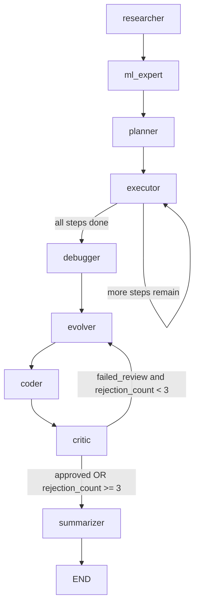

# LaiNUX Architecture Walkthrough

This document explains how your Agentic OS is built, how the graph executes, and how data moves through the system.

## 1) System Overview

LaiNUX is an agentic workflow built with a graph runtime:

- Entry runtime and CLI: `agentic_os/main.py`
- Graph definition and node routing: `agentic_os/agent_graph.py`
- Shared state contract: `agentic_os/state.py`
- Model factory for reasoning and fast models: `agentic_os/llm_factory.py`
- Persistent memory and wisdom storage: `agentic_os/memory/memory_store.py`
- Dashboard/API and websocket broadcast: `agentic_os/service/api.py`
- Tool libraries used by executor: `agentic_os/tools/*.py`

The runtime supports:

- Interactive terminal mode
- One-shot goal mode (`--goal`)
- Autonomous loop mode (`--auto`)
- Dashboard-backed API execution

## 2) Runtime Boot Sequence

When you start with `python -m agentic_os.main`, the flow is:

1. Load environment variables from `.env`.
2. Build reasoning LLM via `create_reasoning_llm()`.
3. Initialize `MemoryStore()` (SQLite + optional RAG vector retrieval).
4. Compile agent graph with `create_agent_graph(llm, memory)`.
5. Start FastAPI dashboard server in a daemon thread.
6. Start file watcher (`start_file_watcher`) for automatic downloads segregation.
7. Enter command loop (`exit`, `auto`, or free-form goals).

## 3) Agent State Contract

The graph passes one mutable state object (`AgentState`) through all nodes.

Core fields:

- `goal`: user intent
- `plan`: list of planner-generated steps
- `current_step_index`: active step pointer
- `tool_outputs`: ordered list of execution outputs
- `status`: lifecycle flag (`started`, `planned`, `finished`, `failed_review`, etc.)
- `final_result`: final output returned to user
- `reflection`: evolver/debugger reflection text
- `wisdom`: retrieved and learned lessons
- `research_notes`: external web context
- `missing_tool`: request or generated code for self-improvement path
- `rejection_count`: critic rejection loop counter
- `summary`: natural-language recap from summarizer

## 4) Graph Topology

Execution graph from `agentic_os/agent_graph.py`:

Important behavior:

- `executor` loops until all planned steps are consumed.
- `debugger` runs after execution and can trigger repair instructions.
- `evolver` always reflects and stores a wisdom nugget.
- `coder` generates proposed code into sandbox if a missing tool/fix is detected.
- `critic` approves/rejects and can loop back to evolver.
- `summarizer` always provides a final human-readable summary before END.

## 5) Node-by-Node Responsibilities

### Researcher Node

File: `agentic_os/researcher.py`

- Decides YES/NO if internet research is needed.
- If YES: creates search query and fetches top results via DuckDuckGo.
- Stores result into `state['research_notes']`.

### ML Expert Node

File: `agentic_os/ml_expert.py`

- Activates for ML-like goals (keywords: train, accuracy, model, segregate, folder, etc.).
- Adds guidance into `state['wisdom']`.
- Checks local classifier existence and appends readiness warning/status.

### Planner Node

File: `agentic_os/planner.py`

- Pulls historical wisdom from memory (`get_wisdom`).
- Attempts to pull knowledge-base context from researcher agent module.
- Prompts LLM to produce JSON list of executable steps.
- Broadcasts updated state to dashboard.
- Contains explicit anti-placeholder instructions.

### Executor Node

File: `agentic_os/executor.py`

- Hot-reloads tool modules each step.
- Converts a textual step into `{tool, args}`.
- Executes mapped tool with signature-filtered args.
- Appends output to `tool_outputs` and increments step index.
- Sets `final_result` when last step completes.

Hardening currently included:

- Placeholder argument resolution (`returned_file_list`, etc.)
- Documents-specific fallback summary generation
- Fallback tool selection parser when model JSON is malformed

### Debugger Node

File: `agentic_os/debugger.py`

- Scans outputs for errors/tracebacks.
- If fixable, writes repair directive into `state['missing_tool']`.
- Provides issue summary in `state['reflection']`.

### Evolver Node

File: `agentic_os/evolver.py`

- Reflects on plan vs outputs.
- Produces:
  - reflection
  - wisdom nugget
  - optional missing tool request
- Persists wisdom into SQLite memory.

### Coder Node

File: `agentic_os/coder.py`

- If `missing_tool` exists, generates Python function with LLM.
- Writes proposal to sandbox path:
  - `sandbox/proposed_tool.py`
- Passes generated code forward via `state['missing_tool']` for critic review.

### Critic Node

File: `agentic_os/critic.py`

- Reviews generated change for security/efficiency/reliability.
- On reject:
  - increments `rejection_count`
  - sets `status = failed_review`
  - routes back to evolver loop
- On approve and code content:
  - appends approved code into production tool file

### Summarizer Node

File: `agentic_os/summarizer.py`

- Creates final human-friendly explanation from:
  - goal
  - steps
  - tool outputs
  - final result
  - status
- Stores output in `state['summary']`.

## 6) Tooling Layer

Primary tool categories:

- Files: `agentic_os/tools/file_tools.py`
- System: `agentic_os/tools/system_tools.py`
- Shell: `agentic_os/tools/shell_tools.py`
- Network: `agentic_os/tools/network_tools.py`
- Testing: `agentic_os/tools/tester_tools.py`
- Docker/Sandbox: `agentic_os/tools/docker_tools.py`
- Vision/UI: `agentic_os/tools/vision_tools.py`
- OS mimic and watcher: `agentic_os/tools/os_mimic_tools.py`

The executor uses a strict tool map and only passes args matching each function signature.

## 7) Memory and Learning

Memory backend:

- SQLite file: `agent_memory.db`
- Tables: `tasks`, `history`, `wisdom`

Learning model:

- Evolver writes wisdom nuggets each run.
- Planner retrieves wisdom by semantic similarity when RAG deps are available.
- If RAG deps are missing, system falls back to recent linear wisdom retrieval.

## 8) Dashboard and API Integration

File: `agentic_os/service/api.py`

- Root endpoint serves dashboard HTML.
- WebSocket endpoint pushes real-time state updates.
- `POST /api/run_task` runs a full graph invocation in background thread.
- API auto-finds open localhost port starting at 8000.

## 9) Execution Modes

### Interactive mode

- Start: `python -m agentic_os.main`
- Prompt: `agent-os >`
- Enter goal text to execute one cycle.

### One-shot mode

- Start: `python -m agentic_os.main --goal "your task"`
- Runs once and exits.

### Autonomous mode

- Start: `python -m agentic_os.main --auto --auto-hours 1`
- Picks goals from a predefined self-improvement list until timeout.

## 10) Known Architectural Strengths

- Clear graph-based orchestration with explicit node boundaries
- Built-in self-healing and self-improvement loop
- Persistent memory and post-run learning
- Real-time dashboard state broadcasting
- Tool hot-reload support for fast iteration

## 11) Current Risks and Practical Notes

- Graph currently always enters debugger/evolver/coder/critic/summarizer chain after execution, even for simple successful tasks.
- Critic can append approved code directly into production tools, so guardrails and tests are important.
- Multiple components rely on LLM JSON compliance; fallback parsing now helps but does not eliminate all malformed-output cases.
- RAG quality depends on optional dependencies being installed.

## 12) Suggested Next Evolution

1. Add a success short-circuit: if no errors and no missing tool, route directly to summarizer.
2. Add schema validation for planner and executor JSON outputs.
3. Add automated tests for each node transition path.
4. Add approval policy before merging generated code into production tools.
5. Add structured run telemetry (duration per node, tool-call success rates).
